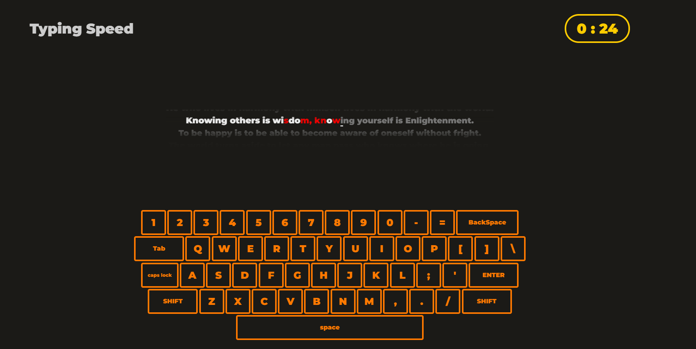
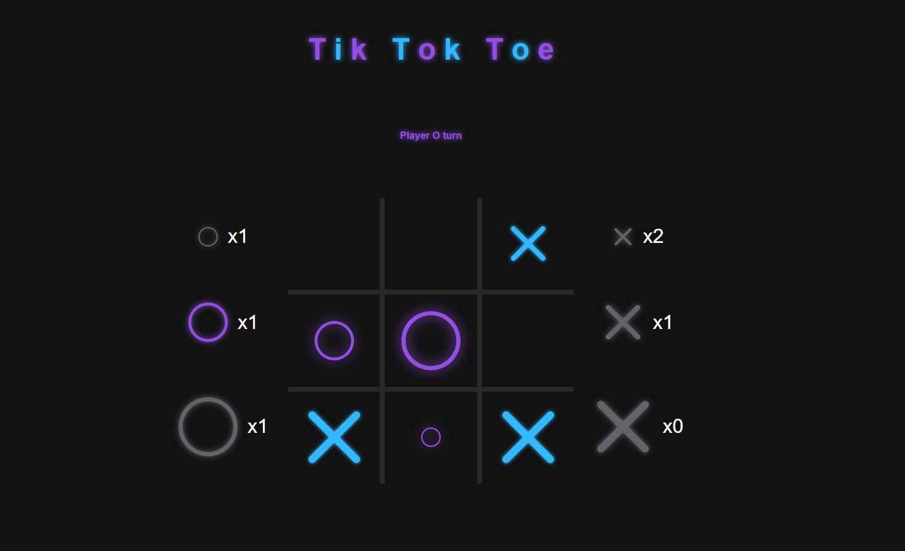

# Hi 👋, I'm Kamil

## Who I am?

I am an ICT student at Poznan University of Technology in Poland. I am passionate about exploring new technology and have a particular interest in CI/CD, as it can improve software development and deployment. I also make time to train at the gym and participate in meetings with other.
## 🛠 Languages and tools

### Familiar with

### Some experient from university or hobbistics

## Links to conferences that I like to watch from time to time

The links contain recordings from conferences such as Azure Summit, Pytech Summit, Dev.js and many more\
[Conferences_1](https://www.youtube.com/@konferencjaonline-canal1162/streams)\
[Conferences_2](https://www.youtube.com/@konferencjaonline-canal2844/streams)\
[Conferences_3](https://www.youtube.com/@konferencjaonline-canal337/streams)\
[Conferences_4](https://www.youtube.com/@konferencjaonline-canal421/streams)

## One project i'am liitle pround

I'm proud not because of technical realisation but results.
[Phishing](https://github.com/KDubicki/Phishing)

## Some games I created to train in my free time

## I really want to learn in the near future

